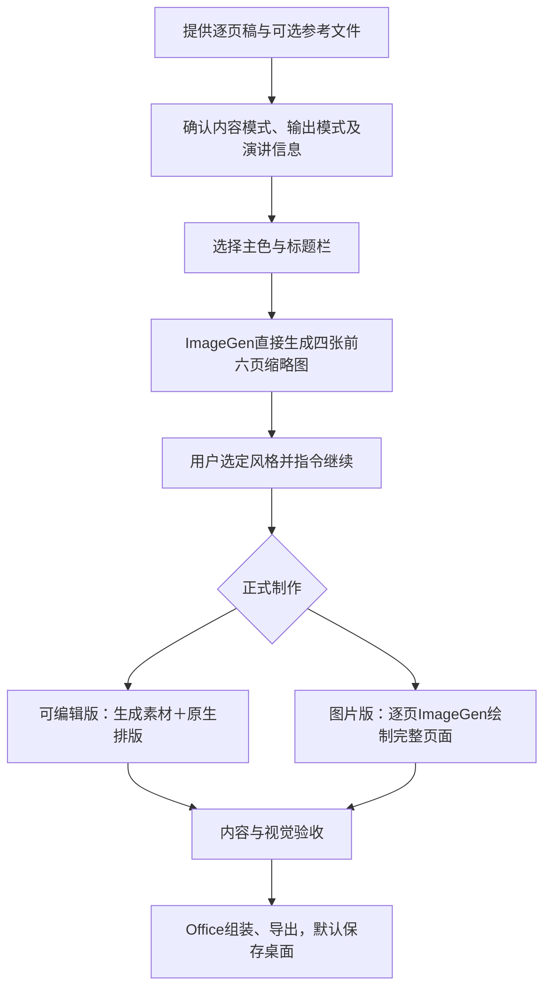
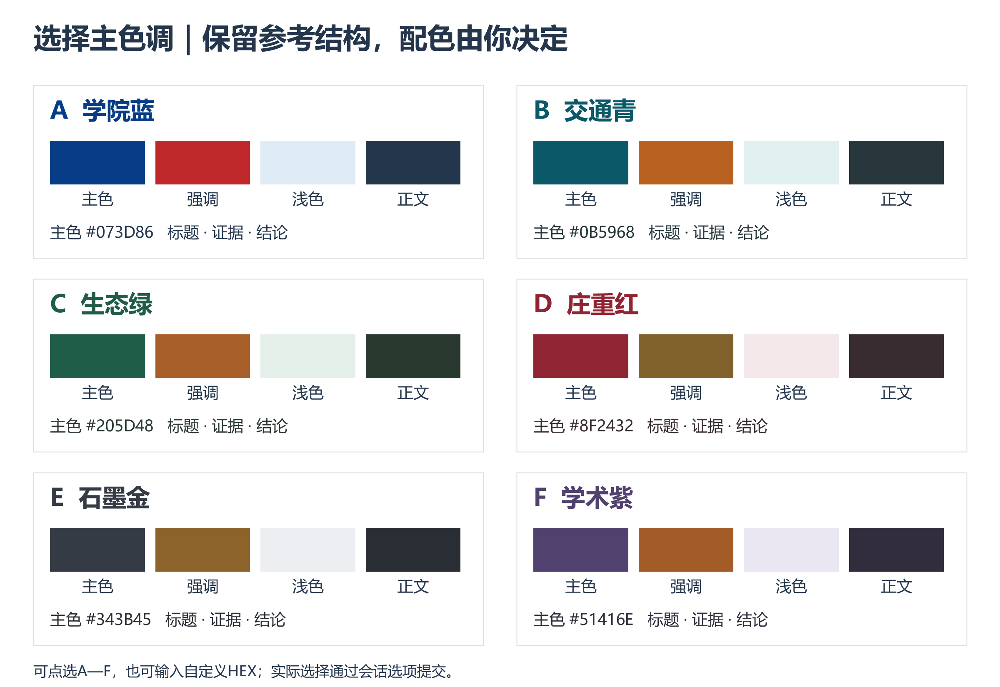
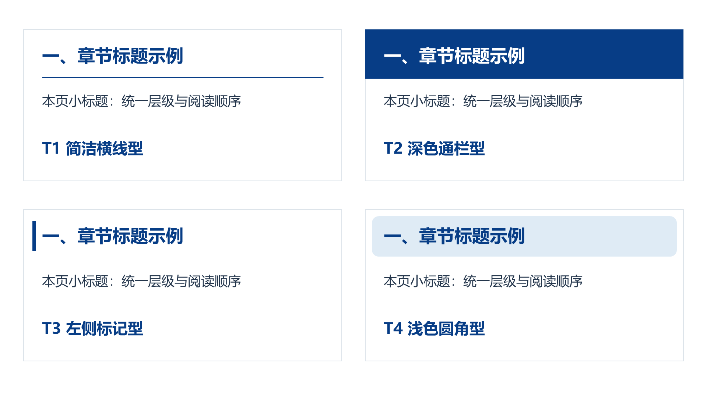

# imagegen-office-ppt

**从逐页稿到图文并茂的 PowerPoint：先选内容与输出模式，再用四张缩略图选风格，最后制作正式稿。**

当前版本：**v2.6**。适用于教学科普、学术交流、工程技术、学院工作与党建汇报等演示文稿。支持参考 PPT/PDF 的版式分析，主要配图与语义图标由 ImageGen 生成，使用 Windows Microsoft PowerPoint 组装并导出。

## 制作流程



风格选择阶段，每个方向直接生成一张 **2列×3行** 缩略图，展示前六页；不足六页用全部。四个方向使用相同页序、核心内容与主色，以构图、图像语言和信息组织体现区别。**不提前逐页生成24张候选页，也不制作预览PPTX。**

缩略图用于选择视觉方向，不能替代正式稿的文字核验，不会裁切成正式页面。用户选定后，从源稿和设计规范制作全部正式页。

## 两组独立选择

### 内容模式

| 模式 | 内容处理 |
| --- | --- |
| 精简版 | 凝练表达、合并重复，保留关键依据、名称、人名、数据、单位、条件、机制、互动与论证链 |
| 详细版 | 尽量把每页全部有效信息保留在可见页面，用分区、图示和排版组织内容 |

两种模式均建立逐页内容映射。把关键信息移到备注不算页面保留；不编造数据、研究成果或参考依据。详细内容过多时先优化版式，确需增加页数则与用户确认。

### 输出模式

| 模式 | 制作方式 | 可编辑范围 |
| --- | --- | --- |
| 可编辑版 | ImageGen生成独立配图与语义图标；PowerPoint原生排版文字、色块、箭头、流程与基础图表 | 原生文字和形状可编辑；图片及图内一体旁注为栅格 |
| 整页图片版 | ImageGen逐页绘制标题、正文、图标、配图及页码；Office每页仅铺放一张整页图 | 可整体替换图片，不能编辑图内单个文字或图形 |

两种内容模式可与两种输出模式自由组合。图片版追求完整画面的设计感，仍须逐字核验中文、数字、单位和图示关系；不提供图内对象的点击揭示动画。可编辑版的基础图表由形状构成，不是Excel数据联动图表。

## 主色与标题栏

先展示实际样本，再由用户在会话中选择。下图为样本板，不是网页内实时切换控件。

### 六套主色

A 学院蓝 · B 交通青 · C 生态绿 · D 庄重红 · E 石墨金 · F 学术紫。支持自定义 HEX 主色。主题包含主色、强调色、浅底色、正文色与背景色，按角色使用。



### 四种标题栏

| 编号 | 样式 |
| --- | --- |
| T1 | 简洁横线：编号、标题与细横线 |
| T2 | 深色通栏：深主色带与白字 |
| T3 | 左侧标记：固定竖色条与标题 |
| T4 | 浅色圆角：浅色标题区与深色文字 |



标题栏与整体风格独立选择，不默认生成4×4共16套候选。样本板为学院蓝，制作时可导出匹配已选主色的样本。

## 图片版标题一致性

正式正文页使用同一坐标规范及标题栏参考图。默认基准为 **1920×1080px**，对应PPT画布 **960×540pt**。

| 元素 | 左上角坐标（px） | 宽×高（px） | 字号目标 |
| --- | --- | --- | --- |
| 一级标题 | 96，48 | 1728×68 | 54px，粗体、左对齐 |
| 二级标题 | 96，132 | 1728×48 | 36px，常规、左对齐 |
| T3竖标记 | 56，48 | 8×64 | 固定形状 |
| 正文 | 起点y≥216 | 按内容设计 | 按层级设置 |

在上述画布中54px对应27pt，36px对应18pt；其他分辨率按比例换算。封面、目录与结束页独立设计。长标题不能自动缩字或移动，优先用章节标题＋本页二级标题表达。

生成后制作全部正文页的标题栏裁切对比图，核验实际位置、视觉字号、基线及标记；偏差用ImageGen修正，**不在Office中覆盖原生标题补救**。数值提示词是生成目标，不能保证ImageGen精确执行；诊断脚本辅助查看，不自动识别字体或判定合格。

详见[图片版标题栏物理规范](references/image-titlebar-contract.md)。

## 页面设计与内容规则

- **封面**：显示演讲标题、演讲人和日期，结合主题整体构图；需要Logo时使用真实标识。
- **目录**：组织章节主线，并使用独立的主题配图。封面、目录与结束页及总页数制作前确认。
- **正文标题**：章节编号一般采用“一、二、三、”；原稿有章节编号则沿用，页序不当作章节编号。相近内容共享章节标题，本页重点用二级标题表达。
- **图标与配图**：按内容生成语义图标；同义图标可复用。场景配图及复杂示意图不得跨页重复，裁切、镜像或换色也不视为新图；真实Logo可复用。
- **色块与渐变**：用于分组、层级、目标或过渡。按文字类型设置行距、段距、内边距和水平/垂直对齐，避免全页同一种卡片或整页粗体。
- **图文关系**：图片解释内容，流程呈现顺序与因果，图表表达数据关系。无数据时不编造比较、趋势或实测结论；生成场景不冒充实拍证据。
- **一体旁注**：必要的名称、文字说明及引线可以随示意图生成在同一张图片中，须核对准确与最终显示尺寸的可读性。
- **页底**：不添加灰色来源、待核或制作过程小字；保留右下角页码及必要结论栏。出处放备注/清单，影响理解的技术条件仍保留在正文或图内。

## 安装与环境

将本仓库内容放入以下目录，确保SKILL.md位于技能文件夹根部：

```text
%USERPROFILE%/.codex/skills/imagegen-office-ppt/
├── SKILL.md
├── agents/
├── assets/
├── examples/
├── references/
└── scripts/
```

需要：

- Codex可访问ImageGen能力，以及本地输入和输出文件。
- Windows、PowerShell和已安装的Microsoft PowerPoint，组装使用PowerPoint COM；无需python-pptx。
- 标题栏裁切对比工具需要已有Python与Pillow。Skill不会自动安装缺少的依赖。

可运行`scripts/check_environment.ps1`检查PowerPoint环境。仅关闭本次创建的文稿，不退出用户整个PowerPoint应用。更新Skill不会自动重制此前输出的PPT。

## 调用示例

首次调用时可以只提供材料，Skill会确认缺少的选项：

```text
使用 $imagegen-office-ppt，根据附件逐页MD和参考PDF制作图文并茂的PPT。
先展示前六页的四种风格缩略图，待我选择并继续后制作正式稿。
```

也可以一次说明本次要求：

```text
使用 $imagegen-office-ppt，根据附件逐页稿制作PPT。
详细版＋整页图片版，F学术紫＋T3标题栏。
受众为高中学生，15分钟，共9页。
演讲人：李彬；演讲日期：2026年10月1日。
先直接生成四张前六页缩略图供我选风格。
```

选定后例如回复：“选择A，继续制作完整PPT。” 已有明确选择不重复询问；风格方向A—D与主色色板A—F是两组不同编号。

## 交付与保存

正式PPTX默认直接保存到**系统实际桌面**，兼容迁移和同步桌面；用户指定路径优先。同名文件使用版本号，避免覆盖。素材、预览及制作记录保存在项目子文件夹。

交付包含PPTX、逐页PNG、全稿概览、素材清单及必要待核事项。备注保留原稿、来源和讲述节奏。制作过程中保存状态和输入哈希，恢复任务时校验。

质量检查同时覆盖内容完整性、图文关系、排版、图中文字可读性和标题一致性；脚本通过不等于设计通过。用户原稿、模板、项目数据、生成素材与正式PPT不会自动公开到本仓库。

## 规则与工具入口

- [Skill主规则](SKILL.md)
- [内容保留规则](references/content-modes.md)
- [输出模式与缩略图流程](references/output-and-preview.md)
- [排版与逻辑融合](references/layout-semantics.md)
- [图标、色块与渐变组件](references/visual-components.md)
- [设计契约](references/design-contract.md)与[交付验收](references/acceptance.md)
- [已有验证记录与边界](references/validation-results.md)

`scripts/assemble_powerpoint.ps1`组装可编辑稿；`scripts/assemble_image_powerpoint.ps1`组装整页图片稿；`scripts/export_slides.ps1`导出页面；`scripts/export_header_comparison.py`生成图片版标题栏诊断图。脚本输入结构见设计契约，示例文件用于说明技术格式，不代表已完成的演示稿。
